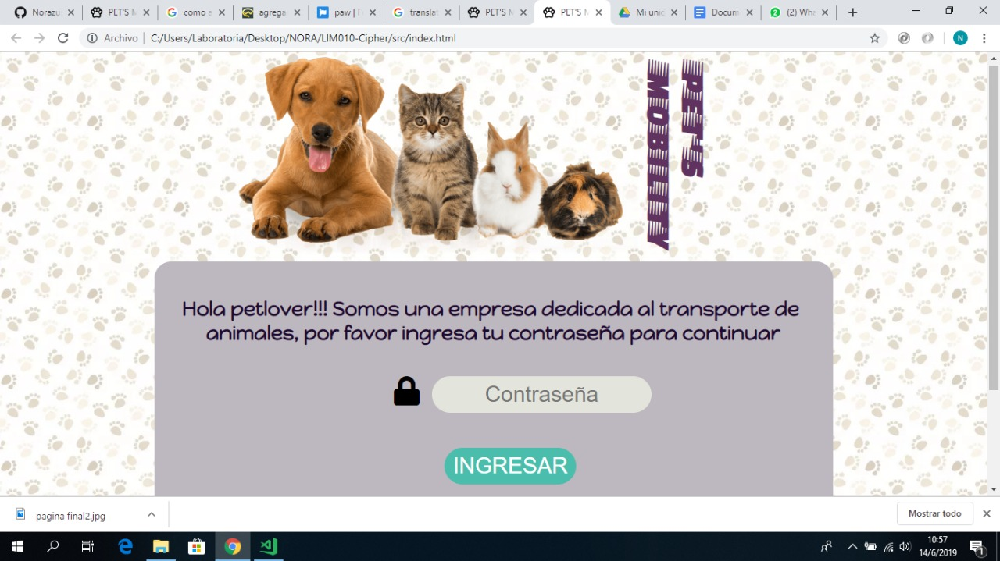
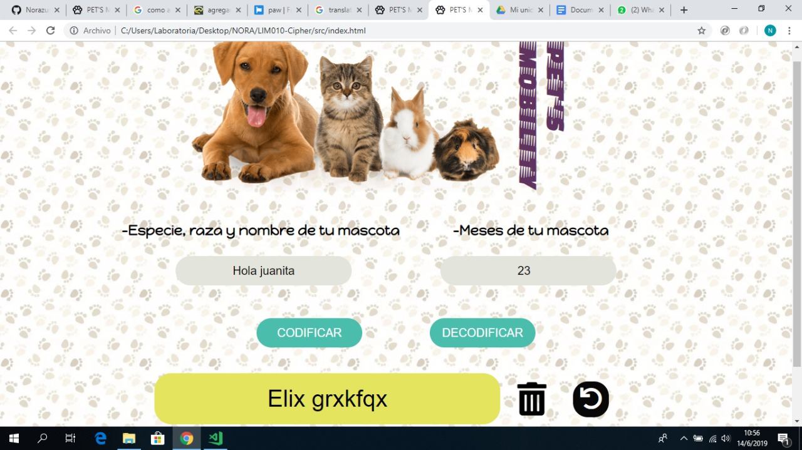
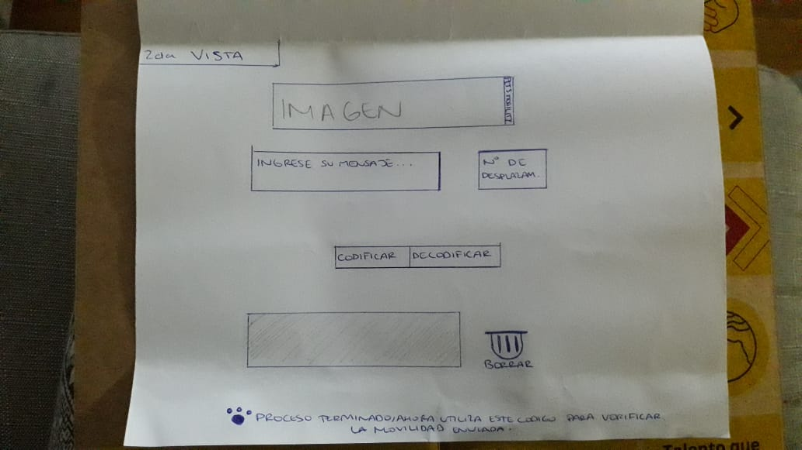
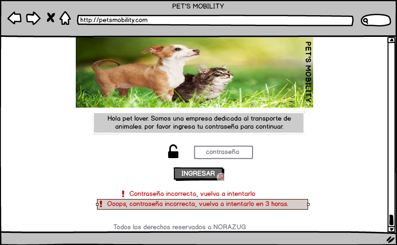
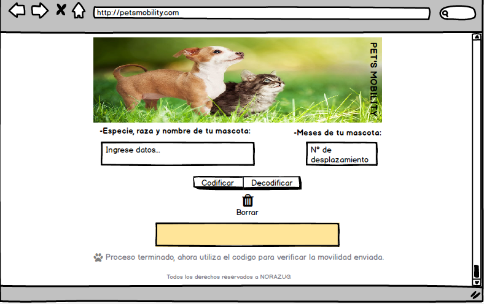

# PETS’S MOBILITY

## Preámbulo

Pet’s Mobility es un aplicativo creado para movilizar a animales de un lado al otro de manera segura.

##Proyecto Final

## Investigación UX

Mi cliente es una persona de 22 años, amante de los animales, específicamente de los perros.  
Su problema normalmente es que debido a que tienes 3 mascotas, se le dificulta transportarlos, ya que los conductores no acceden por un sin fin de excusas muy aparte que es poco seguro.

Pet’s Mobility soluciona este gran problema ya que brinda el servicio de movilidad de forma segura a través de un código, el cual es verificado al momento de enviar la información con el conductor.

### Prototipo en papel:

### Feedback

- Agregarle una introducción para que el usuario lo entienda
- Buscarle sentido a mi cifrado cesar respecto al usuario

### Protipo en BALSAMIQ

-
-